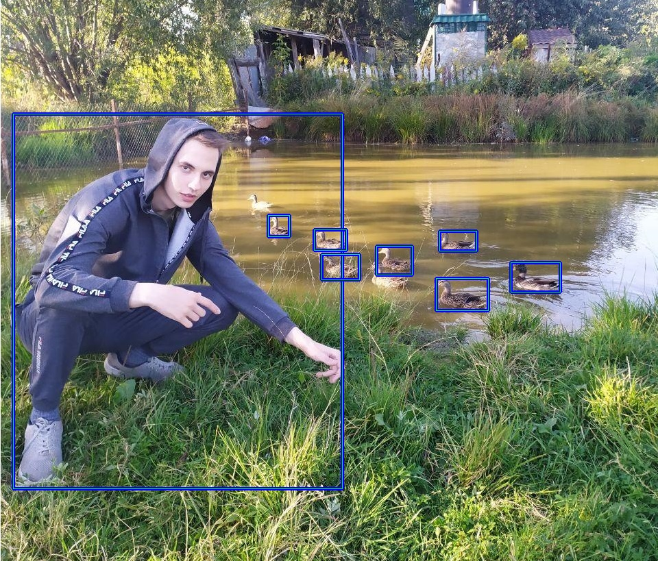

# EfficientDet with Intel OpenVINO

This repository demonstrates how to convert [AutoML EfficientDet](https://github.com/google/automl) to OpenVINO IR.

Follow the steps from [.github/workflows/main.yml](.github/workflows/main.yml) to convert your model.
For public models, download IRs from [GitHub Actions](https://github.com/dkurt/openvino_efficientdet/actions?query=branch%3Amaster)

[](https://github.com/dkurt/openvino_efficientdet/actions?query=branch%3Amaster)

## How to convert model
1. Freeze graph

    ```bash
    cd automl/efficientdet
    python3 model_inspect.py --runmode=saved_model --model_name=efficientdet-d4 --ckpt_path=efficientdet-d4 --saved_model_dir=savedmodeldir
    ```

2. Create IR
    ```bash
    git clone https://github.com/openvinotoolkit/openvino --depth 1

    python3 openvino/model-optimizer/mo.py \
      --input_model efficientdet-d4.pb \
      --transformations_config openvino/model-optimizer/extensions/front/tf/automl_efficientdet.json \
      --input_shape "[1, 1024, 1024, 3]"
    ```
    find resolution of your model at https://github.com/google/automl/blob/master/efficientdet/hparams_config.py

    `automl_efficientdet.json` contains topology hyper-parameters

3. Validate model comparing accuracy with an original frozen TensorFlow graph
    ```bash
    python3 scripts/validate.py --version d4 --width 1024 --height 1024
    ```


